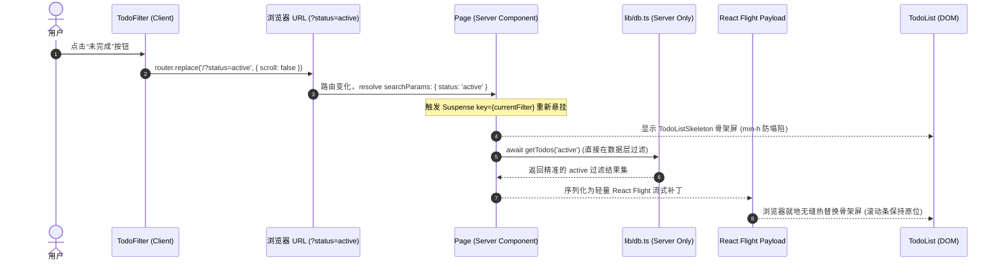

# 01. RSC 心智模型深度解析与思维演进

对于熟练掌握传统 SPA（如 Vite + React 18 / CRA + Redux）的前端工程师而言，转向 React Server Components (RSC) 绝非仅仅是“学习 Next.js 的几个新 API”，而是一场彻底的**架构心智重构**。

本文档系统对比传统 SPA 与 RSC 在三个关键维度的思维差异，并在本项目中进行完全落地。

---

## 一、阶段一：客户端边界最小化（Client Boundary Minimization）

### 1.1 传统 SPA 思维
* **默认假设：** 所有写在 `.tsx` 里的代码都是“浏览器代码”。所有导入的第三方包（如 lodash、dayjs、markdown 解析器）都会打包进最终的客户端 JavaScript Bundle。
* **副作用：** 首屏 JS 体积庞大，网络传输慢，客户端浏览器需要大量时间进行脚本下载、Parse（解析）、Compile（编译）和 Hydration（注水）。

### 1.2 RSC 核心机制
* **默认假设：** **所有组件默认都是 Server Component（服务端组件）**，除非在文件顶部明确标注 `'use client'`。
* **边界原则：**
  * Server Component 在 Node.js 服务端完成 JSX 执行，输出结构化描述（React Flight Payload），其源码和引用的服务端库**永远不会**进入客户端 JS 包。
  * `'use client'` **不是**将组件变成传统的纯客户端渲染，而是划定一个**水合边界（Hydration Boundary）**。只有需要绑定浏览器原生事件（`onClick`, `onChange`）、使用浏览器专属 API（`window`, `localStorage`）或使用 React 客户端 Hooks（`useState`, `useEffect`, `useRef`, `useTransition`）的最小叶子节点，才应该加上 `'use client'`。
* **本项目落地：**
  * `app/page.tsx`：作为页面基底，纯 Server Component。
  * `components/TodoList.tsx`：数据获取与静态容器，纯 Server Component，绝不声明 `'use client'`。
  * `components/TodoInput.tsx`、`components/TodoItem.tsx`、`components/TodoFilter.tsx`：具有点击、表单提交与路由参数监听，声明为最小客户端边界。

---

## 二、阶段二：异步组件与流式直出（Async Components & Streaming SSR）

### 1.1 传统 SPA 思维
* 经典的“挂载后请求”链路：
  ```text
  1. 浏览器请求 HTML (空页面骨架)
  2. 浏览器下载 bundle.js 并执行水合
  3. 组件挂载触发 useEffect(() => { fetchTodos(); }, [])
  4. 呈现长时间全屏 Loading 菊花图
  5. API 返回数据 -> 调用 setTodos(data) & setLoading(false)
  6. 页面发生明显的布局跳动与二次重渲染
  ```
* 这种模式导致严重的多层网络瀑布流（Network Waterfall）。

### 1.2 RSC 核心机制
* **原生异步组件：**
  * 在 RSC 中，服务端组件可以直接是 `async function`：
    ```tsx
    export async function TodoList({ filter }: TodoListProps) {
      const todos = await getTodos(filter); // 直接读文件系统或数据库
      return <ul>...</ul>;
    }
    ```
* **流式直出 (Streaming SSR)：**
  * 配合 React 19 的 `<Suspense>` 机制，Next.js 会立即将页面的非阻塞部分（如 Header 标题、TodoInput、TodoFilter）直出给浏览器，TTFB（首字节时间）几乎为 0。
  * 当 `<TodoList>` 内部的 1000ms 异步 I/O 处于 Pending 状态时，浏览器端立即显示轻量的 Tailwind `animate-pulse` 骨架屏。
  * 一旦服务端 I/O 完成，服务端通过同一个 HTTP 连接追加输出 HTML 片段和 Flight Payload，就地流式替换骨架屏。

---

## 三、阶段三：状态下沉与轻量化（State Sink & Server Actions）

### 3.1 传统 SPA 思维
* **状态过度冗余：**
  * 前端必须安装 Redux Toolkit、Zustand 或维护根级的 `useState<Todo[]>([])`。
  * 添加一个 Todo 时：
    1. 前端发 POST 请求到 `/api/todos`。
    2. 等待响应后，前端手动调用 `setTodos([res.data, ...todos])`。
  * 状态同步极易出现脏数据（网络超时、并发修改、多端不同步）。
* **UI 状态脱离 URL：**
  * 过滤条件（全部/未完成/已完成）存储在内存 Store 中，页面刷新即重置，无法把“未完成任务”链接直接分享给他人。

### 3.2 RSC 核心机制
* **URL 作为单一事实来源（Single Source of Truth）：**
  * 过滤状态由 `useSearchParams` 与 `router.push('?status=active')` 管理。
  * 状态天然具备持久性、可分享性，且完美兼容浏览器前进/后退历史栈。
  * URL 参数变更后，服务端 `app/page.tsx` 的 `searchParams` Promise resolve 新值，驱动精准的数据流更新。
* **Server Actions (`'use server'`) + `revalidatePath`：**
  * 废弃手工维护的 RESTful API 路由（如 `/api/todos`）。
  * 变更直接通过类型安全的 RPC 函数触发：
    ```ts
    // actions/todo.ts
    'use server';
    export async function toggleTodoAction(id: string) {
      await toggleTodo(id);
      revalidatePath('/'); // 服务端重新渲染该路由树并流式下发差异
    }
    ```
  * 客户端通过 React 原生 `useTransition` 捕获 pending 态（如透明度衰减 `opacity-50`），无需在前端维护局部 `useState(todo.completed)`。

---

## 四、思维模型对比总结表

| 维度 | 传统 SPA 模式 | RSC (React Server Components) 架构 |
| :--- | :--- | :--- |
| **组件默认属性** | 全量客户端组件 | 默认为服务端组件，仅在叶子节点标注 `'use client'` |
| **代码打包体积** | 所有引用的库与逻辑均打入浏览器 Bundle | 服务端组件及所用后端库体积为 0 (Zero Bundle Size) |
| **数据读取方式** | 客户端 `useEffect` + `fetch` 发起二次 HTTP 请求 | 服务端组件直接 `await fs.readFile` / 数据库驱动 |
| **渲染与等待体验** | 客户端白屏或全屏菊花图，存在网络瀑布流 | 首屏骨架秒级直出，Suspense 配合流式推流 (Streaming) |
| **数据变更模式** | 手写 `/api/*` + 前端 `setTodos([...prev])` | `Server Action` + `revalidatePath` 服务端增量重验 |
| **状态存储归属** | 客户端内存 Store (Redux, Zustand) | 服务端数据源 + URL Search Params |
| **用户过渡反馈** | 手写 `isLoading` 本地布尔值 | React 19 `useTransition` 原生并发调度 |

---

## 五、RSC 架构黄金法则与实战辨析

### 5.1 黄金法则（The Golden Rule of RSC）

> [!IMPORTANT]
> **“计算与过滤靠近数据源（Server），视图驱动交给 URL（Search Params），客户端只负责纯粹的交互调度（Leaf Components）。”**

这一黄金法则指明了从传统 SPA 转向 RSC 架构时，数据与职责划分的核心边界。

---

### 5.2 深度辨析：为什么不能“一次性把所有任务拉到前端，然后在客户端做过滤”？

在实际项目重构中，很多从传统 SPA 转过来的工程师常有一个直觉方案：
> *“既然 Todo 数据量不大，为什么不在首屏把所有 todos 一次性拉出来，直接在前端写 `todos.filter(t => ...)`？这样切换 Tab 过滤时零网络延迟，岂不是更快？”*

表面上看这减少了一次 1000ms 的网络延迟，但在 RSC 架构下，这属于典型的**反模式（Anti-Pattern）**——即**“披着 Next.js 外衣写传统 SPA”**。

#### ❌ 反模式代码示例（SPA 残留思维）

如果采用前端全量拉取并过滤，代码将被迫写成这样：

```tsx
// ❌ 错误示范：components/BadClientTodoList.tsx
'use client'; // 1. 边界被迫上移！整个列表容器退化为客户端组件

import { useState } from 'react';
import { Todo } from '@/lib/types';

export function BadClientTodoList({ initialTodos }: { initialTodos: Todo[] }) {
  // 2. 重新引入客户端本地状态副本，产生“双重真理源”
  const [todos, setTodos] = useState(initialTodos);
  const [filter, setFilter] = useState<'all' | 'active' | 'completed'>('all');

  // 3. 在客户端执行过滤计算
  const filteredTodos = todos.filter((todo) => {
    if (filter === 'active') return !todo.completed;
    if (filter === 'completed') return todo.completed;
    return true;
  });

  return (
    <div>
      {/* 4. 这里的 filter 仅存在于内存，页面一刷新立即重置为 'all'，无法分享 */}
      <div className="filter-buttons">
        <button onClick={() => setFilter('all')}>全部</button>
        <button onClick={() => setFilter('active')}>未完成</button>
      </div>

      <ul>
        {filteredTodos.map(todo => (
          <li key={todo.id}>
            {todo.title}
            {/* 5. 灾难所在：当调用 Server Action 切换状态后，
                   由于本地状态由 useState 托管，revalidatePath 下发的新数据
                   不会自动同步到本组件的 todos 副本中！
                   开发者被迫又得写 setTodos(prev => ...) 手工同步！ */}
          </li>
        ))}
      </ul>
    </div>
  );
}
```

#### 🚨 弊端深度剖析：

1. **客户端水合边界失守（Zero Bundle Size 破灭）：**
   - 原本数据装配的容器应该是纯粹的 Server Component。为了在客户端做过滤，不得不把大面积的代码标注 `'use client'`，导致组件及其依赖全部被打入浏览器的 JS Bundle 中。
2. **破坏“单一事实来源”，陷入缓存与状态不同步的泥潭：**
   - 当用户调用 `toggleTodoAction(id)` 并触发 `revalidatePath('/')` 时，Next.js 服务端会重新生成最新的 Server Component 树。
   - 但若客户端自己在 `useState` 里克隆了一份 `todos`，服务端的最新数据推流无法自动覆盖已经初始化的 `useState`（React 默认不会用更新的 props 覆盖已存在 state）。前端不得不重新写大量的 `useEffect` 或手动 `setTodos` 去对齐数据，重新掉入传统 SPA 状态混乱的深渊。
3. **丢失“URL 驱动”能力：**
   - 过滤条件仅存在于浏览器运行内存中。用户把当前“未完成任务”的页面链接发给同事，对方打开后看到的却是“全部任务”；点击浏览器“前进/后退”按钮，页面毫无反应。
4. **扩展性极差（放弃流式分块与后端安全能力）：**
   - 一旦业务扩展（如任务包含敏感备注、软删除归档、或者数据量膨胀到数百数千条），全量拉取将造成严重的带宽浪费与前端掉帧，完全失去利用数据库索引和 RSC 按需分块推流（Streaming）的能力。

---

### 5.3 遵循黄金法则的标准模式（本项目落地实现）

本项目严格遵循黄金法则，架构清晰分层：



#### ✅ 标准实现核心代码对照

1. **视图驱动交由 URL（[components/TodoFilter.tsx](file:///C:/myGit/learn-rsc/components/TodoFilter.tsx)）：**
   ```tsx
   // 客户端仅负责把状态同步至 URL，无本地 useState 副本
   const handleFilterChange = (status: TodoFilterType) => {
     const params = new URLSearchParams(searchParams.toString());
     status === 'all' ? params.delete('status') : params.set('status', status);
     startTransition(() => {
       router.replace(`/?${params.toString()}`, { scroll: false });
     });
   };
   ```

2. **计算与过滤靠近数据源（[app/page.tsx](file:///C:/myGit/learn-rsc/app/page.tsx) & [components/TodoList.tsx](file:///C:/myGit/learn-rsc/components/TodoList.tsx)）：**
   ```tsx
   // app/page.tsx (Server Component)
   export default async function Page({ searchParams }: PageProps) {
     const { status } = await searchParams;
     const currentFilter = status || 'all';

     return (
       <div className="min-h-[260px]">
         {/* key 驱动 Suspense 流式推流 */}
         <Suspense key={currentFilter} fallback={<TodoListSkeleton />}>
           <TodoList filter={currentFilter} />
         </Suspense>
       </div>
     );
   }

   // components/TodoList.tsx (纯 Server Component，Zero Client JS)
   export async function TodoList({ filter }: TodoListProps) {
     // 直接在数据访问层过滤，杜绝下发无效字段与多余数据
     const todos = await getTodos(filter);
     return (
       <ul>
         {todos.map(todo => <TodoItem key={todo.id} todo={todo} />)}
       </ul>
     );
   }
   ```

---

### 5.4 架构决策指南：什么时候才允许在客户端做过滤？

| 过滤场景 | 应该放在服务端还是客户端？ | 推荐技术手段 | 判定依据与说明 |
| :--- | :---: | :--- | :--- |
| **Tab 切换（全部/未完成/已完成）** | **服务端 (Server)** | `URL Search Params` + `revalidatePath` | 属于视图维度变更，必须支持 URL 链接分享、刷新保持与浏览器历史栈。 |
| **数据分页 (Pagination)** | **服务端 (Server)** | `/?page=2` + `getTodos({ page, size })` | 避免全量拉取浪费流量，后端利用 DB `LIMIT/OFFSET`。 |
| **即时输入高亮 (Instant Typing Highlight)** | **客户端 (Client)** | `useDeferredValue` / 纯 CSS 视觉高亮 | 仅为每个按键微交互提供即时视觉反馈，不改变底层业务数据流。 |
| **复杂条件高级筛选表单** | **服务端 (Server)** | Form Submit / URL 序列化 | 避免客户端内存模型与服务端模型脱节。 |

