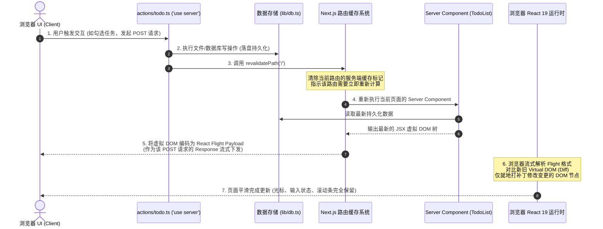
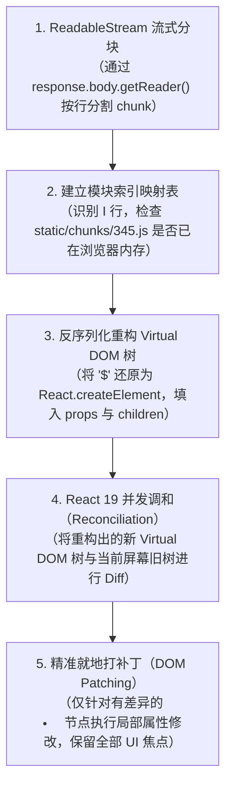

# 04. 深度解析：revalidatePath 与 React Flight 协议

在 React Server Components (RSC) 与 Next.js App Router 架构中，**`revalidatePath`** 与其底层的 **React Flight 协议（RSC Payload）** 是驱动数据变更、缓存重验与非破坏性增量更新的核心引擎。

本文档系统归纳 `revalidatePath` 的工作机制、与传统 SPA 的根本差异、网络层 DevTools 无法预览的底层原因、Flight 协议文本的逐行解密，以及客户端浏览器的流式解析渲染流水线。

---

## 一、`revalidatePath` 的定位与核心机制

* **引入路径：** `import { revalidatePath } from 'next/cache';`
* **执行约束：** **仅限 Node.js 服务端**（在 Server Actions 或 Route Handlers 中调用）。
* **核心定义：**
  > **“主动通知 Next.js 路由缓存系统：指定路径的渲染快照已过期。Next.js 会在服务端重新计算该路径的 Server Component 树，并将计算出的最新虚拟 DOM 打包为 React Flight 数据流，打回给客户端进行就地局部热补丁。”**

### 1.1 端到端完整执行链路



---

## 二、传统 SPA 与 RSC `revalidatePath` 的对比

| 维度 | 传统 SPA 模式 (Vite / React 18) | RSC + `revalidatePath` 模式 (Next.js 15) |
| :--- | :--- | :--- |
| **网络往返** | 至少 2 次往返：<br>1. `POST /api/todos` (写数据)<br>2. 等待成功后 `GET /api/todos` (或由前端手动猜测拼接) | **单次 HTTP 往返搞定：**<br>Server Action POST 写入完成后，最新视图直接在当前 POST 的响应体中流式打回。 |
| **客户端状态管理** | 必须编写胶水代码：<br>`setTodos(prev => [newTodo, ...prev])` 或 dispatch Redux。极易产生竞态与脏数据。 | **前端零状态副本：**<br>彻底移除客户端数据数组的 `useState`。数据源永远留在服务端，服务端重验即等于真理。 |
| **组件重新渲染** | 依赖客户端逐级通知、甚至导致子树大面积重新渲染或全屏闪烁。 | **非破坏性就地热补丁：**<br>通过 React 调和算法，未受影响的客户端表单输入草稿、焦点、滚动条均被 100% 保留。 |

---

## 三、函数签名与应用场景规范

```typescript
revalidatePath(originalPath: string, type?: 'page' | 'layout'): void;
```

1. **刷新具体页面（默认）：**
   ```typescript
   revalidatePath('/');              // 重验首页
   revalidatePath('/todos');         // 重验 /todos 页面
   ```
2. **刷新动态路由匹配项：**
   ```typescript
   revalidatePath('/todos/[id]', 'page'); // 使所有匹配动态路由的页面重验
   ```
3. **刷新整层布局及下属全部子页面（谨慎使用）：**
   ```typescript
   revalidatePath('/dashboard', 'layout'); // 使 /dashboard 及其所有子路由全部重验
   ```
   *注意：除非是全局主题或主侧边栏结构变动，普通数据列表变更只需重验当前 `'page'`，避免无谓消耗服务器 CPU。*

---

## 四、网络层探秘：DevTools 无法预览之谜

在 Chrome 开发者工具的 Network 面板中，检查 Server Action 发起的 POST 请求时，常常会发现 **"Preview"** 标签页显示空白或提示无法预览。

### 4.1 原因揭秘
* 传统的 Ajax 请求返回的是 `Content-Type: application/json` 或 `text/html`，Chrome 内置的格式化渲染器可以直接以 JSON 树或网页预览展现。
* Server Action 返回的是 **`Content-Type: text/x-component`**。这是 Next.js 与 React 专用的流式文本类型，Chrome 没有针对它的图形化预览器。
* 切换到 **"Response"（原始响应文本）** 标签页，即可看到真实传输的按行流式数据。

---

## 五、逐行解剖：真实的 React Flight 响应数据

一段典型的 Server Action + `revalidatePath` 响应体源码如下：

```text
0:{"action_return_value":null}
1:I["components/TodoItem.tsx",["345","static/chunks/345.js"],"TodoItem"]
2:HL["/_next/static/css/app.css","style"]
3:["$","div",null,{"className":"min-h-[260px]","children":["$","ul",null,{"children":[
  ["$","$L1","1",{"todo":{"id":"1","title":"理解 RSC","completed":true}}],
  ["$","$L1","2",{"todo":{"id":"2","title":"体验流式直出","completed":false}}]
]}]}]
```

### 5.1 核心字符协议对照表

| 行标识 / 关键符号 | 协议语义 | 作用解释 |
| :--- | :--- | :--- |
| **`0:{"action_return_value": ...}`** | Action 返回值 | 存放 `actions/todo.ts` 中当前函数的返回值；若无则是 `null`。 |
| **`1:I["路径", [chunks], "组件名"]`** | 客户端组件导入记录<br>*(Import Record)* | 声明带有 `'use client'` 的组件引用指针与所在的 JS chunk 静态资源路径。**服务端绝不渲染客户端组件内部 DOM，只输出引用！** |
| **`2:HL[...]`** | 资源预加载指令<br>*(Head Link)* | 指示浏览器提前并行拉取所需的 CSS 样式表或字体，避免二次加载样式跳动。 |
| **`["$", "tag", key, props]`** | **React Element 的紧凑序列化** | React 源码中虚拟 DOM 节点的 `$$typeof` 为 `Symbol.for("react.element")`。Flight 协议将其紧凑序列化为 **`"$"`**。 |
| **`"$L1"`** | **客户端组件占位引用**<br>*(Lazy Reference)* | 指示浏览器：“在此节点挂载第 1 行声明的 `TodoItem` 客户端组件，并传入后面的 props 数据”。 |

---

## 六、客户端浏览器的 5 步解析流水线

浏览器接收到这串 `text/x-component` 字节流后，并不是简单地 `JSON.parse`，而是经过了精密的恢复链路：



---

## 七、为什么不直接返回传统 JSON？

经常有工程师提出疑问：*“为什么服务端不直接返回 `{ success: true, todos: [...] }` 这种普通 JSON，让前端自己去更新？”*

RSC 团队选择返回 Flight 协议而非纯 JSON，具有深远的架构考量：

1. **消除前端状态胶水代码：**
   如果返回纯 JSON，前端就必须为每一个增删改接口编写数据解析、异常捕获、`setTodos` 插入、排序以及多组件同步逻辑。Flight 协议直接将**计算完毕的组件树形态**打过来，前端不再需要任何状态维护代码。
2. **天然支持服务端组件（Zero-Bundle Components）静态嵌套：**
   页面中可能包含大量的 Server Components（例如带有复杂权限判断、服务端 Markdown 编译的组件）。如果只发 JSON，客户端必须把这套庞大的 Markdown 解析引擎和规则引擎打包进前端 JS Bundle；而 Flight 协议下，服务端已经在云端编译好了最终结构，**客户端浏览器零额外体积开销**。
3. **无损状态保留（State Preservation）：**
   如果重新请求全量 HTML，浏览器会白屏重刷丢失状态；而通过 Flight 协议送入 React 19 调和器，只有产生差异的节点才会被更新。用户正在其他表单输入的文字、正在播放的音视频、滚动条位置均**100% 保持不动**。

---

## 八、总结

> **`revalidatePath` 触发的不是简单的“清缓存”，而是一场由服务端重新计算、经过 React Flight 协议紧凑编码、并在客户端就地局部打补丁的“现代化响应式闭环”。**
> 它彻底打破了前后端在状态同步上的拉锯战，让前端界面真正做到了“只关注交互，不管理数据仓库”。
